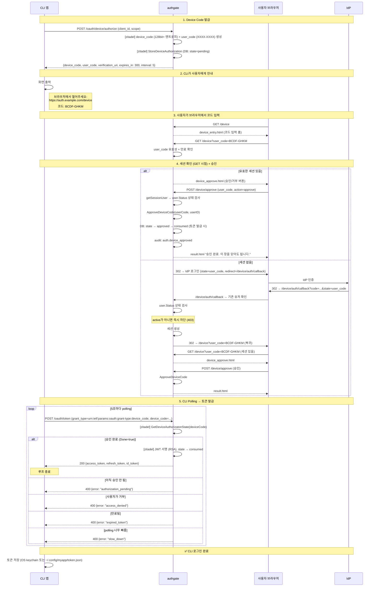
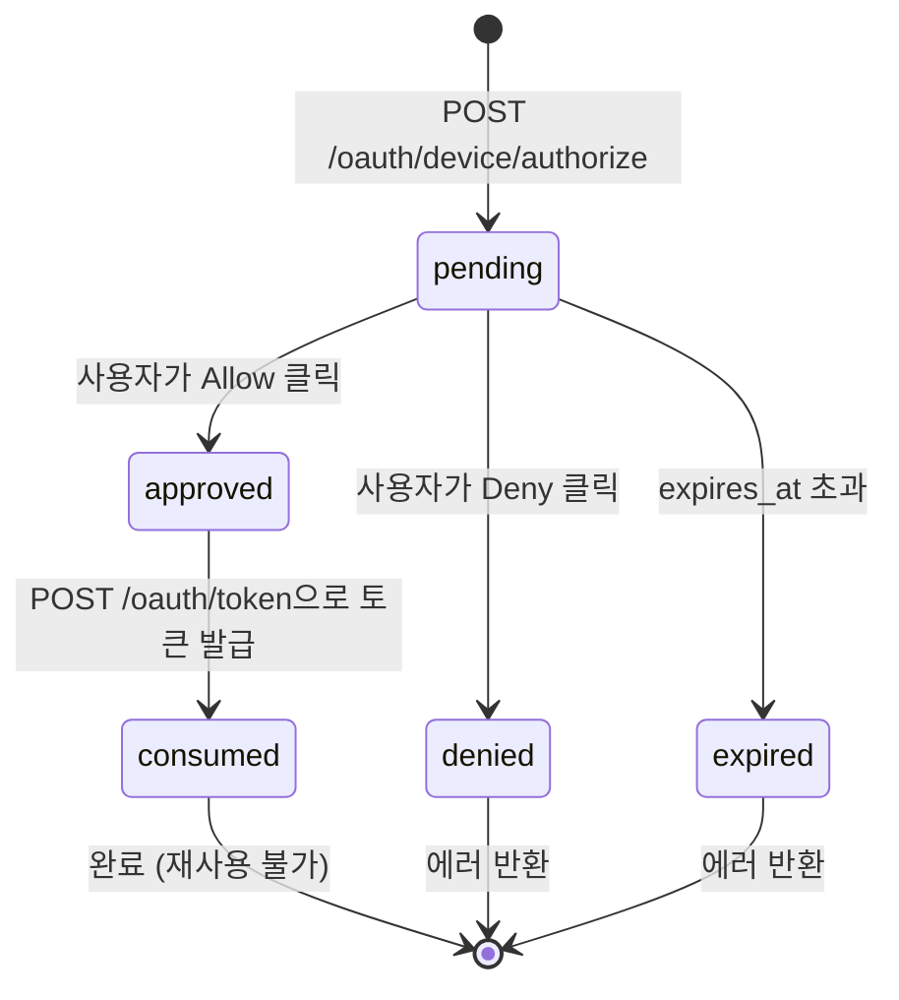

# Spec 003: Device 로그인 (RFC 8628 Device Authorization Grant)

## 개요

CLI 도구나 입력 제한 장치에서 브라우저를 통해 인증하고 access_token + refresh_token을 받는 플로우.
**사용자는 브라우저 가입(Spec 001)이 완료된 상태여야 한다.** Device 플로우에서 신규 가입은 발생하지 않는다.

## 전제

- authgate에서 zitadel/oidc는 **내장 라이브러리**다. 별도 서버가 아니다.
- 앱이 `clients.yaml`에 등록되어 있어야 함 (grant_type에 device_code 포함)
- **성공적으로 Device 토큰을 발급받으려면** `user.Status = 'active'`여야 함 (Spec 001 경유, [ADR-000](../adr/000-authgate-identity.md) 정의)
- 사용자가 브라우저 접근 가능해야 함
- (선택) 리소스 바인딩이 필요한 CLI/MCP 도구는 `clients.yaml`에 `allowed_resources`를 명시해야 함 ([ADR-003](../adr/003-resource-bound-device-tokens.md))

## 관련 엔드포인트

모든 경로는 authgate 주소 기준이다.

| Method | Path | 내부 처리 | 설명 |
|--------|------|----------|------|
| POST | `/oauth/device/authorize` | zitadel 라이브러리 | device_code + user_code 발급. 리소스 바인딩 시 `resource` 파라미터 포함 |
| GET | `/device` | authgate 핸들러 | user_code 입력 폼 |
| GET | `/device?user_code=XXXX` | authgate 핸들러 | 승인/거부 페이지 (세션 필요) |
| POST | `/device/approve` | authgate 핸들러 | 사용자 승인/거부 처리 |
| GET | `/device/auth/callback` | authgate 핸들러 | Device 전용 IdP callback (state=user_code) |
| POST | `/oauth/token` | zitadel 라이브러리 | grant_type=device_code → polling → 토큰 발급. 리소스 바인딩 시 동일 `resource` 필수 |

**`/device/auth/callback`은 `/login/callback`과 별도 엔드포인트다.**
브라우저 로그인의 `state=authRequestID`와 Device의 `state=user_code`가 섞이지 않는다.

## 표준

- RFC 8628 (OAuth 2.0 Device Authorization Grant)
- 5분 만료, 5초 polling 간격

## 플로우



## 상태 전이



`consumed` 상태가 있어야 토큰 발급 후 device_code 재사용을 막을 수 있다.

## 세션 없이 승인 시 흐름

Device 플로우의 주요 사용자(CLI 첫 사용자)는 브라우저 세션이 없을 가능성이 높다.
이 경우 **로그인 → 복귀** 패턴으로 처리한다:

```
1. /device?user_code=XXXX → 세션 없음 감지
2. IdP 로그인 redirect (state=user_code, redirect_uri=/device/auth/callback)
3. IdP 인증 성공 → /device/auth/callback?code=...&state=user_code
4. user_code state 사전 검증 (pending 아니면 invalid_request 400, IdP Exchange 호출 안 함)
5. IdP Exchange → 기존 유저 확인 → user.Status 상태 검사 (active가 아니면 즉시 차단)
6. 세션 생성 → /device?user_code=XXXX로 302 redirect
7. 승인 페이지 표시 → 사용자 승인
```

**Step 6→7 은 세션 쿠키의 `SameSite`에 의존한다.**
6번에서 발급한 세션 쿠키가 7번 요청에 실려야 승인 페이지가 뜬다. 이 홉은
상위 IdP에서 시작된 리다이렉트 체인의 마지막 구간이므로, 쿠키가 `SameSite=Strict`이면
WebKit(Safari)이 이를 전송하지 않는다. 그러면 7번에서 다시 "세션 없음"으로 판정되어
1번으로 돌아가고, 사용자는 IdP 로그인만 반복하게 된다. 따라서 세션 쿠키는 `Lax`여야 한다
([Spec 002 보안 요구사항](002-browser-login.md#보안-요구사항)).

**Step 4 (validate-before-exchange) 는 보안상 load-bearing이다.**
`user_code`가 unknown/expired/non-pending 상태에서는 IdP token 엔드포인트
호출 자체를 막아 outbound traffic 증폭과 IdP quota 소모 공격을 차단한다.
브라우저 callback도 동일 패턴(#171)을 사용한다.

**`/login/callback`과 분리된 별도 엔드포인트를 사용한다.**
`state`의 의미가 엔드포인트별로 고정되며, 다른 형식이면 `invalid_request`로 거부한다:
- `/login/callback` → `state = authRequestID`만 허용 (브라우저/MCP 로그인)
- `/device/auth/callback` → `state = user_code`만 허용 (Device 로그인)

**미가입 사용자가 Device 플로우에 진입하면:**
`/device/auth/callback`에서 `GetUserByProviderIdentity` → `ErrNotFound`로 차단된다.
가입은 여기서 발생하지 않고, 브라우저 로그인 채널에서 먼저 완료해야 한다.

## 에러 케이스

| 상황 | 대상 | 에러 코드 | HTTP | 설명 |
|------|------|----------|------|------|
| 아직 승인 안 됨 | CLI | `authorization_pending` | 400 | 계속 polling |
| 사용자가 거부 | CLI | `access_denied` | 400 | polling 종료 |
| device_code 만료 | CLI | `expired_token` | 400 | 재시작 필요 |
| polling 너무 빠름 | CLI | `slow_down` | 400 | interval + 5초 |
| 이미 토큰 발급됨 (consumed) | CLI | `invalid_grant` | 400 | 재사용 불가 |
| 잘못된/만료된 user_code | 브라우저 | — | 200 | 에러 메시지 포함 HTML |
| 세션 없이 승인 시도 | 브라우저 | — | 302 | IdP 로그인으로 redirect |
| 미가입 사용자 | 브라우저 | `account_not_found: please sign up via browser first` | 403 | 브라우저 가입 먼저 필요 |
| 비활성 계정 (disabled/deleted) | 브라우저 | `account_inactive` | 403 | 승인 불가 |
| pending_deletion 계정 | 브라우저 | `account_inactive` | 403 | 브라우저 복구만 가능 (상태 검사) |
| 클라이언트 `access` 정책이 계정 거부 | 브라우저 (`/device/auth/callback`, `/device/approve`) | `This account is not allowed to use this application. You can close this window.` | 403 | 콜백은 IdP가 방금 준 email·email_verified·hd로, 승인은 저장된 값으로 평가. 세션을 만들지 않거나 승인하지 않고 `auth.access_denied`(`channel: device`) 기록. device code는 pending으로 남아 다른 계정으로 다시 승인할 수 있고, 아니면 만료된다. 거부 버튼은 정책과 무관 |
| 승인 후 정책이 계정 거부 | CLI (polling) | `access_denied` | 400 | 저장된 값으로 재평가, 토큰 발급 안 함, `auth.access_denied` 기록. code는 서버에 `approved`로 남지만 RFC 8628 클라이언트는 `access_denied`에서 polling을 멈추므로 보통 처음부터 다시 로그인 |

## 상태 전이 원자성

device_code의 `approved → consumed` 전이는 원자적이어야 한다:

```
단일 UPDATE ... WHERE device_code = $code AND state = 'approved'
또는
SELECT ... FOR UPDATE → state 확인 → UPDATE
```

현재 구현은 `SELECT ... FOR UPDATE`로 device_code row를 잠근 뒤, `approved`일 때
`UPDATE device_codes SET state='consumed' WHERE id=$1`를 같은 트랜잭션에서 실행한다.

동시 polling 요청이 오더라도 정확히 1번만 토큰을 발급한다. 두 번째 요청은 `invalid_grant`.

상태 검사: `/device/auth/callback`(세션 생성 전)과 `approve` 두 시점 모두에서 [ADR-000](../adr/000-authgate-identity.md#채널별-상태-검사-규칙)의 규칙을 적용한다. `user.Status`가 `active`가 아니면 세션 생성/승인 불가 (403).

## Resource-Bound Device Tokens

일반 Device 토큰은 `aud = client_id`다. CLI/MCP 도구가 특정 protected resource용 토큰이 필요하면 `clients.yaml`에서 `allowed_resources`로 명시적으로 opt-in한다 ([ADR-003](../adr/003-resource-bound-device-tokens.md)).

### 등록 규칙

```yaml
clients:
  - client_id: mcp-cli
    client_type: public
    login_channel: mcp
    name: MCP CLI
    allowed_scopes: [openid, offline_access]
    allowed_grant_types:
      - "urn:ietf:params:oauth:grant-type:device_code"
      - refresh_token
    allowed_resources:
      - "https://mcp.example.com"
```

- `allowed_resources`가 비어 있으면 해당 클라이언트는 resource-bound가 아니다 (기본값, 하위 호환).
- `allowed_resources`는 `login_channel: browser` 클라이언트에 허용되지 않는다.
- `allowed_resources`가 있는 클라이언트는 반드시 `device_code` grant를 포함하고 `authorization_code` grant를 포함해서는 안 된다.
- `allowed_resources` 항목은 exact match로 비교한다.

### 플로우

```text
POST /oauth/device/authorize
  client_id=mcp-cli
  scope=openid offline_access
  resource=https://mcp.example.com

→ 200 {device_code, user_code, verification_uri, ...}
```

승인 후 polling:

```text
POST /oauth/token
  grant_type=urn:ietf:params:oauth:grant-type:device_code
  device_code=...
  client_id=mcp-cli
  resource=https://mcp.example.com
```

- `/oauth/device/authorize`와 `/oauth/token` 모두 동일한 단일 `resource`를 포함해야 한다.
- `resource` 누락/불일치/허용되지 않은 값은 `invalid_target` 400으로 거부한다.
- `resource`가 두 번 이상 나타나면 `invalid_target` 400으로 거부한다 (single-audience policy).
- 잘못된 `resource`로 인한 polling 거부는 device_code를 `consumed`로 바꾸지 않는다.

### 토큰 의미

| 토큰 | audience | 설명 |
|------|----------|------|
| access_token | `resource` | protected resource용 JWT |
| id_token | `client_id` | OIDC Core audience는 client_id 그대로 |
| refresh_token | opaque | `refresh_tokens.resource`에 동일 resource 저장 |

refresh로 갱신하면 새 access_token의 `aud`는 동일 resource를 유지한다.

### /userinfo, /oauth/introspect 경계

resource-bound access_token은 일반 OIDC `aud=client_id` 토큰과 다른 용도이므로 `/userinfo`에서 거부한다. 리소스 서버는 JWKS로 서명·issuer·exp·aud/resource를 직접 검증해야 한다. 자세한 내용은 [Spec 005](005-token-lifecycle.md#userinfo와-introspection의-access-token-경계)를 참조한다.

## 보안 요구사항

- device_code: 128bit 이상 엔트로피 (32 hex 또는 22 base64url). 추측 불가
- user_code: 대문자만, 모호한 문자 제외 (0/O, 1/I 등). XXXX-XXXX 형식
- 만료된 device_code는 승인 불가 (`WHERE expires_at > NOW()`)
- polling 간격 5초 강제 (`slow_down` 응답 시 +5초)
- `consumed` 상태의 device_code는 재사용 불가
- resource-bound device grant는 `/oauth/device/authorize`에서 허용된 resource로 바인딩되며, 승인 후 변경 불가

## 다른 스펙 참조

| 참조 | 내용 |
|------|------|
| [Spec 001](001-signup.md) | 가입은 브라우저 전용. Device에서 신규 가입 불가 |
| [Spec 005](005-token-lifecycle.md) | CLI가 받은 토큰의 갱신/폐기 |
| [Spec 007](007-data-model.md) | device_codes 테이블 스키마 |
| [Spec 008](008-pages.md) | device_entry.html, device_approve.html, result.html |
