# Spec 007: 데이터 모델

## 개요

authgate가 소유하는 모든 데이터의 테이블 구조, 관계, 제약조건을 정의한다.
데이터 소유 범위는 [ADR-000](../adr/000-authgate-identity.md)의 "저장하는 데이터 / 저장하지 않는 데이터"를 따른다.

## 테이블 관계

```mermaid
erDiagram
    users ||--o{ user_identities : "1:N (IdP 매핑)"
    users ||--o{ sessions : "1:N (로그인 상태)"
    users ||--o{ refresh_tokens : "1:N (토큰 갱신)"
    users ||--o{ refresh_token_families : "1:N (재사용 tombstone)"
    users ||--o{ audit_log : "1:N (이벤트 기록)"
    users {
        uuid id PK "DEFAULT uuid_generate_v4()"
        bytea email_ciphertext "nullable, AEAD"
        bytea email_nonce "nullable"
        text email_enc_key_id "FK crypto_key_epochs"
        int email_enc_version "nullable"
        text email_hash "nullable, lookup HMAC, UNIQUE"
        text email_hash_key_id "FK crypto_key_epochs"
        int email_hash_version "nullable"
        boolean email_verified "NOT NULL, DEFAULT false"
        bytea name_ciphertext "nullable, AEAD"
        bytea name_nonce "nullable"
        text name_enc_key_id "FK crypto_key_epochs"
        int name_enc_version "nullable"
        text status "NOT NULL, DEFAULT 'active', CHECK (active/disabled/pending_deletion/deleted)"
        timestamptz deletion_requested_at "nullable"
        timestamptz deletion_scheduled_at "nullable"
        timestamptz deleted_at "nullable"
        timestamptz created_at "NOT NULL, DEFAULT NOW()"
        timestamptz updated_at "NOT NULL, DEFAULT NOW()"
    }

    crypto_key_epochs {
        text key_id PK "영구 식별자, regex 제약"
        text domain "enc | lookup"
        text status "active | verify_only | revoked"
        text verify_tag "HMAC(epoch-verify subkey, key-epoch:v1:domain:key_id)"
        int version "HKDF/crypto material format version"
        timestamptz created_at "NOT NULL, DEFAULT NOW()"
        timestamptz activated_at "nullable"
        timestamptz retired_at "nullable"
        timestamptz revoked_at "nullable"
    }

    user_identities {
        uuid id PK "DEFAULT uuid_generate_v4()"
        uuid user_id FK "NOT NULL, CASCADE"
        text provider "NOT NULL, OIDC issuer에서 파생 (예: google, mock 등)"
        text provider_sub_hash "nullable, lookup HMAC, UNIQUE(provider, provider_sub_hash)"
        text provider_sub_hash_key_id "FK crypto_key_epochs"
        int provider_sub_hash_version "nullable"
        bytea provider_sub_ciphertext "nullable, AEAD (회전 rehash용 복구)"
        bytea provider_sub_nonce "nullable"
        text provider_sub_enc_key_id "FK crypto_key_epochs"
        int provider_sub_enc_version "nullable"
        text hosted_domain "nullable, Google hd (평문)"
        timestamptz created_at "NOT NULL, DEFAULT NOW()"
    }

    sessions {
        uuid id PK "DEFAULT uuid_generate_v4(), 내부 PK (쿠키 아님)"
        uuid user_id FK "NOT NULL, CASCADE"
        text token_hash UK "nullable, 세션 쿠키 bearer 해시 (lookup/session HMAC)"
        timestamptz expires_at "NOT NULL, 기본 24시간(SESSION_TTL)"
        timestamptz revoked_at "nullable, 로그아웃 시 설정"
        timestamptz created_at "NOT NULL, DEFAULT NOW()"
    }

    refresh_tokens {
        uuid id PK "DEFAULT uuid_generate_v4()"
        text token_hash UK "NOT NULL, SHA-256 해시"
        uuid family_id "NOT NULL, rotation 추적"
        uuid user_id FK "NOT NULL, CASCADE"
        text client_id "NOT NULL"
        text resource "nullable, MCP resource identifier"
        text[] scopes "NOT NULL, DEFAULT '{}'"
        timestamptz expires_at "NOT NULL, 기본 30일(REFRESH_TOKEN_TTL)"
        timestamptz revoked_at "nullable, revoke 시 설정"
        timestamptz used_at "nullable, rotation 시 설정"
        timestamptz created_at "NOT NULL, DEFAULT NOW()"
        uuid parent_id "nullable, 교환 전 토큰 id (FK 없음)"
    }

    refresh_token_families {
        uuid family_id PK "tombstone된 family만 행 존재 (sparse)"
        uuid user_id FK "NOT NULL, CASCADE"
        text reason "NOT NULL, reuse_detected | revoked"
        timestamptz revoked_at "NOT NULL, DEFAULT NOW()"
    }

    auth_requests {
        uuid id PK "DEFAULT uuid_generate_v4()"
        text client_id "NOT NULL"
        text resource "nullable, MCP resource identifier"
        text redirect_uri "NOT NULL"
        text[] scopes "NOT NULL, DEFAULT '{}'"
        text state "nullable"
        text nonce "nullable"
        text code_challenge "nullable"
        text code_challenge_method "DEFAULT 'S256'"
        text[] prompt "NOT NULL, DEFAULT '{}', OIDC prompt 값"
        bigint max_age "nullable, OIDC max_age 초. NULL=요청 안 함, 0=즉시 재인증"
        text subject "nullable, 인증 완료 시 설정"
        timestamptz auth_time "nullable, 인증 완료 시 설정"
        boolean done "NOT NULL, DEFAULT false"
        text code "nullable, SaveAuthCode 시 설정"
        timestamptz expires_at "NOT NULL, 10분"
        timestamptz created_at "NOT NULL, DEFAULT NOW()"
    }

    device_codes {
        uuid id PK "DEFAULT uuid_generate_v4()"
        text device_code UK "NOT NULL, 128bit+ 엔트로피"
        text user_code UK "NOT NULL, XXXX-XXXX"
        text client_id "NOT NULL"
        text resource "nullable, v0.10.0 legacy reserved column"
        text[] scopes "NOT NULL, DEFAULT '{}'"
        text state "NOT NULL, DEFAULT 'pending', CHECK (pending/approved/denied/consumed)"
        text subject "nullable, approve 시 설정"
        timestamptz expires_at "NOT NULL, 5분"
        timestamptz auth_time "nullable, approve 시 설정"
        timestamptz last_polled_at "nullable, token polling cadence 추적"
        timestamptz created_at "NOT NULL, DEFAULT NOW()"
    }

    audit_log {
        bigserial id PK
        uuid user_id FK "nullable, SET NULL"
        text event_type "NOT NULL"
        inet ip_address "nullable"
        text user_agent "nullable"
        jsonb metadata "nullable"
        timestamptz created_at "NOT NULL, DEFAULT NOW()"
    }
```



## 테이블별 상세

### 영구 데이터

| 테이블 | 목적 | 수명 | 삭제 정책 |
|--------|------|------|----------|
| **users** | 신원 (sub, email, name, status) | 영구 | PII 스크러빙 (30일 유예 후) |
| **user_identities** | IdP 매핑 (IdP sub ↔ 로컬 user) | 영구 | CASCADE (users 삭제 시) |

`user_identities.hosted_domain`은 upstream 로그인 때 받은 Google Workspace 도메인(`hd` 클레임)이다.
로그인(신규·기존, 모든 채널)마다 기록하고(값이 같으면 쓰지 않는다), `hd`가 없으면 NULL로 비운다. 클라이언트 `access` 정책의
`google_workspace_domains`가 세션 재사용·device 승인·code 교환·device polling·refresh에서 IdP 왕복 없이 이 값을 본다.
계정 단위로 읽을 때는 가장 최근 identity의 값을 쓰며, 그 값이 NULL이면 다른 identity의 값으로 대신하지 않는다
([009 운영](009-operations.md#클라이언트-접근-정책-access)). migration 019 이전에 로그인한 계정은 다음 로그인까지 NULL이다.
조직 도메인이지 개인 식별 정보가 아니므로 **평문으로 저장**한다(ADR-002 암호화 대상 아님).

### 설정 데이터 (DB 외부)

| 데이터 | 목적 | 저장 위치 | 관리 방식 |
|--------|------|----------|----------|
| **클라이언트 설정** | 등록된 앱 (client_id, redirect_uri 등) | `clients.yaml` → 메모리 | YAML 파일 수정 후 서버 재시작 |
| **CIMD 클라이언트** | MCP 클라이언트 (client_id = URL) | 클라이언트가 호스팅 → on-demand fetch | 저장 없음, HTTP 캐시만 |

### 세션/토큰 데이터

| 테이블 | 목적 | 수명 | 삭제 정책 |
|--------|------|------|----------|
| **sessions** | 로그인 상태 | SESSION_TTL (기본 24시간) | 만료 후 cleanup |
| **refresh_tokens** | 토큰 갱신 권한 | REFRESH_TOKEN_TTL (기본 30일) | 폐기 후 30일 뒤 hard delete |
| **refresh_token_families** | 재사용 감지로 폐기된 family tombstone | 영구 | CASCADE (users 삭제 시) |

### 임시 데이터

| 테이블 | 목적 | 수명 | 삭제 정책 |
|--------|------|------|----------|
| **auth_requests** | 로그인 진행 중 상태 | 10분 | 만료 후 1시간 뒤 cleanup |
| **device_codes** | CLI 로그인 진행 중 상태 | 5분 | 만료 후 1시간 뒤 cleanup |

### 감사 데이터

| 테이블 | 목적 | 수명 | 삭제 정책 |
|--------|------|------|----------|
| **audit_log** | 운영 이벤트 | 이벤트별 차등 익명화 | 사용자 활동은 `AUDIT_LOG_PII_RETENTION_DAYS`(기본 90일), 운영자 조치(`admin.*`)는 `ADMIN_AUDIT_LOG_PII_RETENTION_DAYS`(기본 730일) 후 user_id/IP/User-Agent = NULL |

#### event_type 목록

이벤트별 의미와 metadata는 아래 **감사 이벤트 (audit_log.event_type)** 섹션을 정본으로 둔다. 컴플라이언스 매핑은 [docs/security/001-audit-evidence-matrix.md](../security/001-audit-evidence-matrix.md).

## 인덱스

PK/UNIQUE/FK 제약 인덱스 외에 현재 명시적으로 생성하는 보조 인덱스는 다음과 같다.

| 인덱스 | 대상 | 목적 |
|--------|------|------|
| `audit_log_user_created_idx` | `audit_log (user_id, created_at DESC)` | 사용자별 audit timeline 조회 (migration 004) |
| `audit_log_event_created_idx` | `audit_log (event_type, created_at DESC)` | 운영 이벤트 timeline 조회 |
| `audit_log_created_brin_idx` | `audit_log USING BRIN (created_at)` | 보존기간 cutoff 기반 PII 익명화 스캔 보조 |
| `user_identities_user_id_idx` | `user_identities (user_id)` | user 삭제 cascade 시 full scan 방지 (migration 012) |
| `sessions_user_id_idx` | `sessions (user_id)` | user 삭제 cascade 시 full scan 방지 (migration 012) |
| `refresh_tokens_user_id_idx` | `refresh_tokens (user_id)` | user 삭제 cascade 시 full scan 방지 (migration 012) |
| `refresh_tokens_family_id_idx` | `refresh_tokens (family_id)` | reuse 감지 family revoke (`WHERE family_id=$`) full scan 방지 (migration 012) |
| `refresh_tokens_parent_id_idx` | `refresh_tokens (parent_id) WHERE parent_id IS NOT NULL` | 재사용 유예의 교환별 자식 수 집계 (migration 017) |
| `refresh_token_families_user_id_idx` | `refresh_token_families (user_id)` | user 삭제 cascade 시 full scan 방지 (migration 013) |

현재 `sessions.expires_at`, `auth_requests.expires_at`, `device_codes.expires_at`, `refresh_tokens.expires_at/revoked_at`에는 별도 보조 인덱스를 만들지 않는다. 운영에서 조회 패턴이 커지면 다음 원칙으로 인덱스를 추가한다:
1. 실제 병목 쿼리를 기준으로 추가한다.
2. cleanup 경로(`expires_at`)와 토큰 경로(`token_hash`, `family_id`)를 우선 고려한다.
3. 추가 시 이 문서와 마이그레이션을 함께 갱신한다.

## 제약조건

```sql
-- users
CHECK (status IN ('active', 'disabled', 'pending_deletion', 'deleted'))

-- device_codes
CHECK (state IN ('pending', 'approved', 'denied', 'consumed'))

-- user_identities
UNIQUE (provider, provider_sub_hash)  -- 로그인 매칭 (user_identities_provider_sub_hash_key). NULL 다중 허용(Postgres UNIQUE)
FOREIGN KEY (user_id) REFERENCES users(id) ON DELETE CASCADE

-- sessions
FOREIGN KEY (user_id) REFERENCES users(id) ON DELETE CASCADE

-- refresh_tokens
FOREIGN KEY (user_id) REFERENCES users(id) ON DELETE CASCADE

-- refresh_token_families
FOREIGN KEY (user_id) REFERENCES users(id) ON DELETE CASCADE
-- audit_log
FOREIGN KEY (user_id) REFERENCES users(id) ON DELETE SET NULL
BEFORE UPDATE OR DELETE trigger: core event facts append-only, user_id/ip_address/user_agent는 NULL redaction만 허용
```

**CASCADE는 `DELETE FROM users` 시에만 동작한다.** authgate는 계정 삭제 시 `UPDATE users SET status='deleted'`를 사용하므로 CASCADE가 트리거되지 않는다. 연관 데이터는 Spec 006 3단계에서 명시적으로 DELETE한다.

## client_id 참조 규칙

`auth_requests.client_id`, `device_codes.client_id`, `refresh_tokens.client_id`는 클라이언트 설정의 `client_id`를 논리적으로 참조한다. 클라이언트 설정은 DB가 아닌 메모리(YAML 또는 CIMD)에 존재하므로 FK는 없다.

클라이언트 종류별 참조:
- **YAML 클라이언트**: `client_id`는 `clients.yaml`에 정의된 문자열
- **CIMD 클라이언트**: `client_id`는 MCP 클라이언트가 호스팅하는 메타데이터 URL

연관 데이터는 자연 소멸한다:
- auth_requests, device_codes: 임시 데이터 (10분/5분) → 자연 만료 후 cleanup 삭제
- refresh_tokens: 클라이언트가 메모리에서 사라져도 만료까지 DB에 남음. 갱신 시도 시 클라이언트 조회 실패로 거부 → 만료 후 cleanup 삭제

## auth_requests.resource 규칙

`auth_requests.resource`는 MCP authorization에서 사용하는 protected resource 식별자다.

`device_codes.resource`는 migration 016으로 추가됐다. v0.10.1에서는 사용하지 않았으나
ADR-003 이후 resource-bound Device token을 지원한다. 이미 운영 DB에 적용된
migration 이력을 보존하기 위해 컬럼과 migration 번호를 삭제하거나 재사용하지 않는다.

```text
Browser / Device (resource-bound 아님)
  -> NULL

MCP authorization_code / Device resource-bound
  -> canonical resource URI 저장
```

규칙:
1. `/authorize` 또는 `/oauth/device/authorize` 요청의 `resource`를 해당 임시 상태(`auth_requests` 또는 `device_codes`)에 저장
2. `/oauth/token` 요청의 `resource`와 일치해야 한다
3. Device grant의 resource는 `/oauth/device/authorize` 시점에 허용된 값으로 고정되며 승인 후 변경할 수 없다
4. 성공적인 code exchange/device token 발급이 끝나면 임시 상태는 정리된다

## 보안 규칙

| 규칙 | 적용 |
|------|------|
| provider sub은 lookup HMAC + AEAD ciphertext로 저장 | `provider_sub_hash`(매칭) + `provider_sub_ciphertext`(회전 복구). 평문 `provider_user_id` 컬럼은 제거됨(migration 014) |
| email/name은 AEAD ciphertext로 저장, email은 lookup HMAC도 | `email_ciphertext`/`name_ciphertext` + `email_hash`(UNIQUE/정규화 lowercase+NFC). 평문 `email`/`name` 컬럼은 제거됨(migration 014). 탈퇴 시 ciphertext/hash redaction |
| 단명 코드(device_code/user_code/authz code)는 lookup HMAC로 저장 | 기존 컬럼에 in-place 해시. 짧은 수명이라 drain, 반환 모델은 평문 입력값 |
| refresh_token은 SHA-256 해시로 저장 | `token_hash` 컬럼 |
| 세션 쿠키(bearer)는 해시로 저장 | `sessions.token_hash` (`id`는 내부 PK). lookup/session HMAC |
| audit_log.metadata의 `session_id`는 해시로 저장 | audit sanitize 시 세션과 동일한 lookup/session HMAC (평문 bearer 미기록) |
| client_secret은 bcrypt 해시로 저장 | `clients.yaml`의 `client_secret_hash` 필드 |
| access_token(JWT)은 DB에 저장하지 않음 | stateless |
| PII 스크러빙 시 email, name 제거 | `deleted` 상태 전이 시 |
| audit_log는 보존기간 후 user_id/IP/User-Agent 익명화 | cleanup job + `AUDIT_LOG_PII_RETENTION_DAYS` |

## 감사 이벤트 (audit_log.event_type)

| 이벤트 | 시점 | metadata |
|--------|------|----------|
| `auth.signup` | 가입 | `{channel, client_id, client_name}` |
| `auth.login` | 로그인 | `{channel, session_id, client_id, client_name, reused_session, signup}` |
| `auth.channel_mismatch` | auth_request 채널 불일치 | `{expected_channel, actual_channel, client_id, client_name}` |
| `auth.deletion_requested` | 탈퇴 요청 | `{channel, session_id, client_id, client_name}` |
| `auth.deletion_cancelled` | 탈퇴 취소 (로그인 복구) | `{channel, session_id, client_id, client_name}` |
| `auth.deletion_completed` | PII 스크러빙 완료 | `{reason}` |
| `auth.device_code_issued` | 디바이스 코드 발급 | `{client_id, client_name}` |
| `auth.device_approved` | 디바이스 승인 | `{client_id, client_name}` |
| `auth.device_denied` | 디바이스 거부 | `{client_id, client_name}` |
| ~~`auth.token_refreshed`~~ | 더 이상 방출하지 않음 (과거 데이터에만 존재) | — |
| `auth.logout` | RP-Initiated Logout | `{client_id, client_name}` |
| `auth.token_revoked` | refresh token revoke (grant 전체) | `{client_id, client_name}` |
| `auth.refresh_reuse_detected` | 폐기된 refresh_token 재사용 탐지 | `{family_id}` |
| `auth.refresh_family_revoked` | family 전체 revoke (탈취 의심) | `{family_id}` |
| `auth.refresh_reuse_grace` | 교환된 refresh_token을 유예 시간 안에 재제출 | `{family_id, outcome: issued\|refused}` |
| `auth.inactive_user` | pending_deletion/disabled/deleted 로그인 시도 | `{status, channel, phase}` |
| `auth.access_denied` | 클라이언트 `access` 정책이 계정 거부 | `{client_id, client_name, channel, reason: deny_listed\|not_allowed\|email_unverified, domain, signup}` — `domain`은 이메일 도메인만, 가입 거부면 user_id 없음 |

`metadata`는 `Storage.AuditLog`에서 event별 allowlist를 통과한 key만 저장한다.
allowlist에 없는 email, token, secret, raw request payload 등은 저장하지 않는다.
